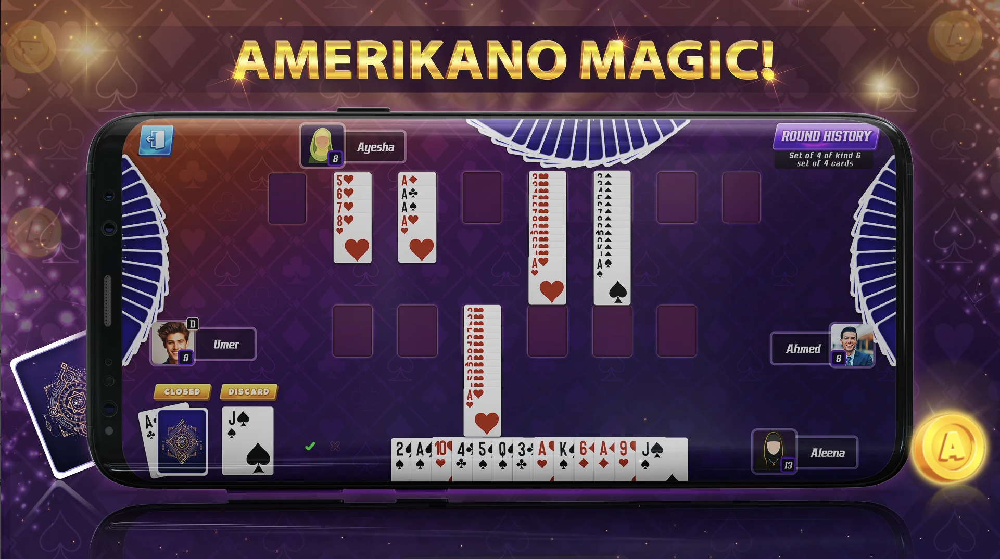
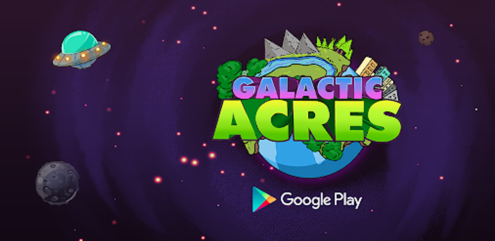
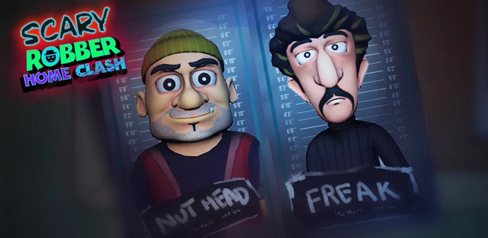

|   | 🔥CAR RENTAL SYSTEM (.NET FRAMEWORK)| 
|------------------|-----------------------------|
|   Description    | A Rental Management System built with .NET Web Forms, featuring user authentication, item management,and secure password hashing using SHA-256. The application utilizes ADO.NET for SQL Server connectivity and implements CRUD operations.|
|   Key Features:  |- User sign-up and login  - CRUD operations for rental items   - Entity Framework for data access   - User-friendly interface MDI|
| Technologies: |- .NET Web Forms  - ADO.NET   - SQL Server   - System.Security.Cryptography.Algorithms(Nuget Package)|

| |Match 3 Game |
| ------| ------| 
| Description |A puzzle game, where we swap adjacent gems on a board to create a match of three or more of the same type gem. Destroy gems on making a match, gems move down and board refills. Boosters appear on making a match of required count of gems. 	 |
| My Role: | As a Software Engineer, I worked on gems swipe, 2D sprite animations, boosters, live feature, level designing.|

| | Amerikano Card Game |
| ------| ------| 
| Description | Amerikano is a unique and addicting card game from the Rummy family. Amerikano is played with 106-card pack (2 packs of 52 and 2 Jokers); each player is dealt 13 cards and the aim is to finish the cards in hand by forming set and sequence combinations 	 |
| My Role: | As a Software Engineer, I worked on Multiplayer Pun2 and also worked on how to connect, join the lobby, create & join a room, custom properties, RPCs, and shuffle cards, turns & sync on both sides.  | 
|Game Link |([https://play.google.com/store/apps/details?id=com.amerikano.legends.card.games&hl=en](https://play.google.com/store/apps/details?id=com.amerikano.legends.card.games&hl=en))|

| |Galactic Acres |
| ------| ------| 
| Description |idle game (clicker, or simulator game). Unlock cute animals in the sanctuary, upgrade to buy managers and increase your earning, and join forces to defeat space pirates in this new idle clicker game!	 |
| My Role: |  As a Software Engineer, I worked on UI, localization, and Shop. |
|Game Link |([https://play.google.com/store/apps/details?id=com.goodgaming.galactic&hl=en_US](https://play.google.com/store/apps/details?id=com.goodgaming.galactic&hl=en_US))|

| | Hide N' Pranks |
| ------| ------| 
| Description | A hybrid casual game based on ‘sneak’ and ‘multiple choice’ mechanics. Hide n pranks is about Nick, who is on the lookout for Scary Teacher to prank her without getting detected. The player has to pick the right option to prank the Teacher that keeps the players engaged with its funny prank reactions.|
| My Role: | As a Software Engineer, I was responsible for working on features including revive functionality (in case the teacher caught you, revive panel will appear with a button of Ad, if you click it and watch Ad it will revive the player from the same spot; otherwise the level will be failed), timer (how much time a player takes to complete the level) and pop-ups notifications to show multiple rewards and other engaging materials from the company.  | 
|Game Link |([https://play.google.com/store/apps/details?id=com.zatg.catchme.pranks&hl=en](https://play.google.com/store/apps/details?id=com.zatg.catchme.pranks&hl=en))|

| | Scary Robber Home Clash |
| ------| ------| 
| Description | A 3D game in a large environment where 2 robbers come into a house where the kid is alone. The kid has to hide from the robbers and has to set a prank for them to terrify them.|
| My Role: | As a Software Engineer, I worked on multiple levels of development, animations, timelines, VFX, and SFX. While completing the project, I was working to make game aesthetics look more catchy and engaging to the users while also helping the team to come up with various pranks that can be added to the game to engage users.  | 
|Game Link |([https://play.google.com/store/apps/details?id=com.zatg.catchme.pranks&hl=en](https://play.google.com/store/apps/details?id=com.zatg.scaryrobber.boylife&hl=en))|

